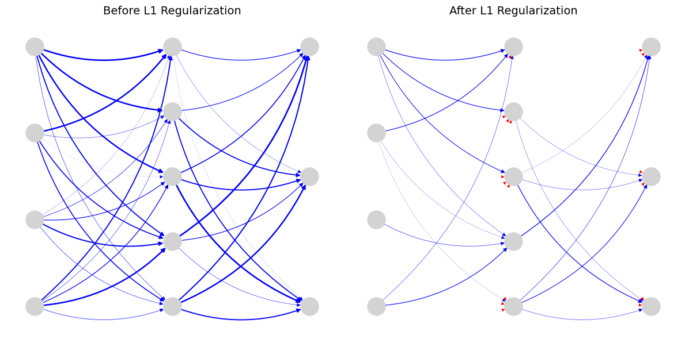
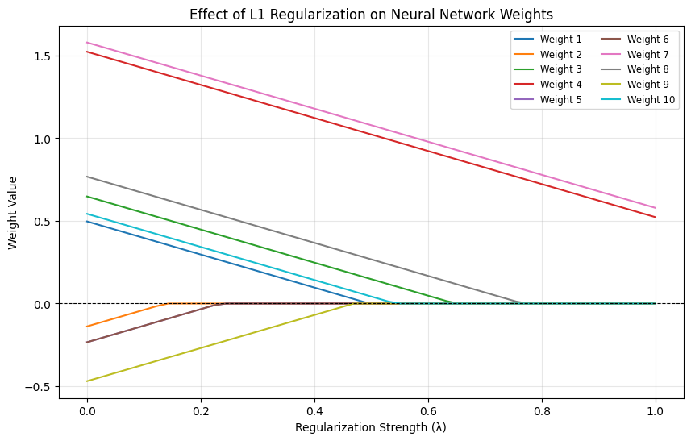
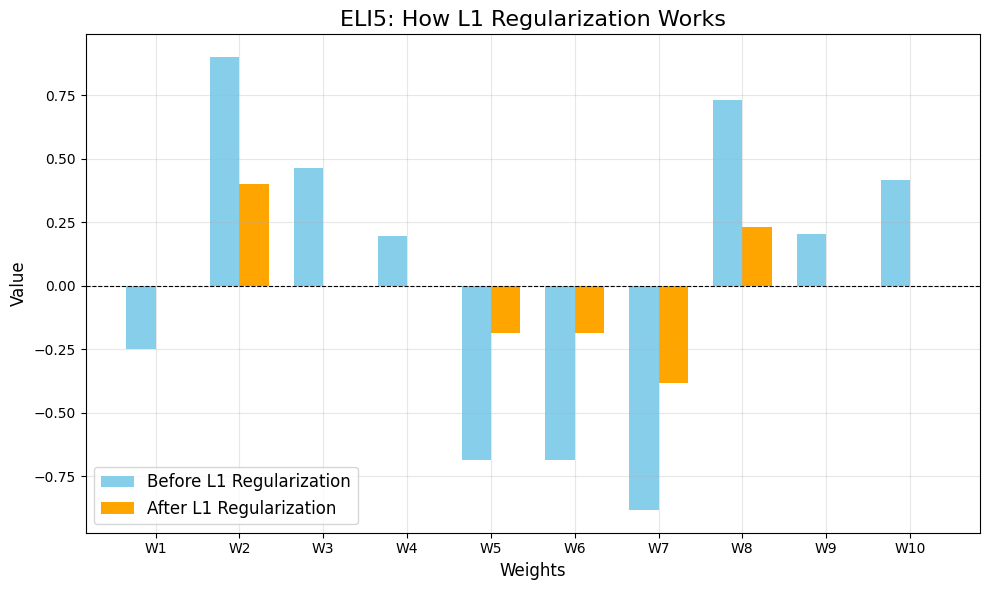
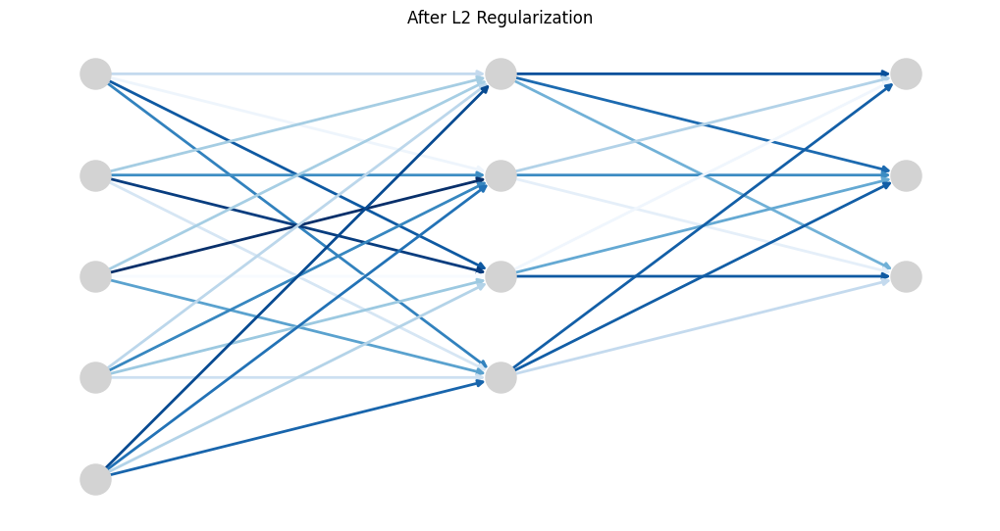
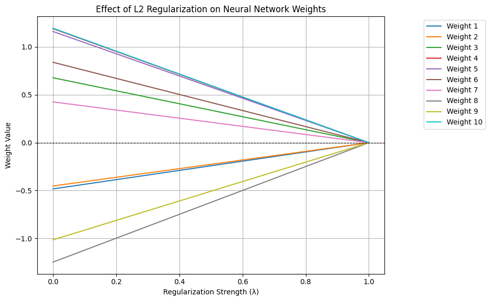

# Understanding L1 and L2 Regularization

L1 and L2 regularization are techniques used to prevent overfitting in machine learning models by adding a penalty to the model's loss function. This penalty discourages the model from learning overly complex patterns that may not generalize well to unseen data.

## How They Work

### L1 Regularization (Lasso)

- **What it does**: Adds a penalty proportional to the absolute values of the model's weights.
- **Mathematical Form**:  
  \[
  \lambda \sum |w_i|
  \]  
  where \( w_i \) are the weights of the model, and \( \lambda \) is a hyperparameter controlling the strength of the penalty.
- **Effect**: Encourages sparsity in the model by driving some weights to exactly zero. This makes L1 regularization useful for feature selection, as it effectively removes less important features.

#### Visualizing L1 Regularization

1. **Before and After L1 Regularization**  
     
   _ELI5_: Imagine a messy web of connections. L1 regularization cuts some of the unnecessary connections, leaving only the important ones.

2. **Effect of L1 Regularization on Neural Network Weights**  
     
   _ELI5_: As we increase the regularization strength (\( \lambda \)), some weights shrink to zero, like turning off unimportant switches.

3. **ELI5: How L1 Regularization Works**  
     
   _ELI5_: Think of weights as bars. Before regularization, some bars are tall and some are short. After regularization, only the most important bars remain, while others shrink to zero.

---

### L2 Regularization (Ridge)

- **What it does**: Adds a penalty proportional to the square of the model's weights.
- **Mathematical Form**:  
  \[
  \lambda \sum w_i^2
  \]  
  where \( w_i \) are the weights of the model, and \( \lambda \) is a hyperparameter controlling the strength of the penalty.
- **Effect**: Encourages smaller weights overall, but does not drive them to zero. This helps in reducing the complexity of the model without completely eliminating features.

#### Visualizing L2 Regularization

1. **After L2 Regularization**  
     
   _ELI5_: Imagine a tangled web of connections. L2 regularization smooths out the connections, making them more uniform without completely removing any.

2. **Effect of L2 Regularization on Neural Network Weights**  
     
   _ELI5_: As we increase the regularization strength (\( \lambda \)), all weights shrink proportionally, like turning down the volume on all channels equally.

---

### Key Considerations

- **Hyperparameter \( \lambda \)**: Controls the strength of the regularization. A higher \( \lambda \) increases the penalty, leading to smaller weights.
- **Use Cases**:
  - L1 is preferred for feature selection due to its sparsity-inducing property.
  - L2 is preferred for reducing model complexity without eliminating features.

---

### Advantages of L1 and L2 Regularization

- **L1 Regularization**:

  - Encourages sparsity, making it useful for feature selection.
  - Reduces overfitting by removing irrelevant features.

- **L2 Regularization**:
  - Reduces overfitting by discouraging large weights.
  - Helps in creating simpler models that generalize better.

---

### Disadvantages of L1 and L2 Regularization

- **L1 Regularization**:

  - May not work well when all features are important.
  - Can lead to instability in optimization.

- **L2 Regularization**:
  - Does not perform feature selection as it does not drive weights to zero.
  - May not be effective when irrelevant features dominate the dataset.

---

**[← Previous](problem_solution.md)** | **[Next →](dropout.md)**

## Navigation

- [Introduction to Regularization](README.md)
- [How Regularization Techniques Work](problem_solution.md)
- [Understanding L1 and L2 Regularization](LX.md)
- [Understanding Dropout Regularization](dropout.md)
- [Understanding Early Stopping](earlystop.md)
- [Understanding Data Augmentation](data_augmentation.md)
