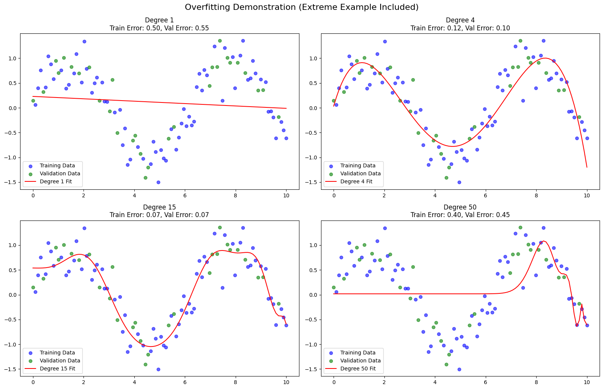

# Regularization in Deep Learning (ELI5)

Regularization is like teaching a model to not "overthink." When training a deep learning model, it might memorize the training data too well, which makes it bad at handling new, unseen data (this is called overfitting). Regularization helps the model focus on the important patterns instead of the noise.

Some common regularization techniques include:

1. **L1/L2 Regularization**: Adds a penalty to the model's weights to keep them small and simple.
2. **Dropout**: Randomly "turns off" some neurons during training to make the model more robust.
3. **Early Stopping**: Stops training when the model starts overfitting.
4. **Data Augmentation**: Adds variety to the training data to prevent memorization.

In short, regularization helps models generalize better and avoid being too "confident" about the wrong things.

## Overfitting Demonstration

Below is a visualization of overfitting using polynomial regression models of varying complexity:

- **Degree 1**: Underfitting, with both training and validation errors high.
- **Degree 4**: A good balance between training and validation performance.
- **Degree 15**: Overfitting starts to appear, with validation error increasing.
- **Degree 50**: Extreme overfitting, with training error near zero but very high validation error. The curve oscillates wildly to fit the training data points exactly.

---

**[Next →](problem_solution.md)**

## Navigation

- [Introduction to Regularization](README.md)
- [How Regularization Techniques Work](problem_solution.md)
- [Understanding L1 and L2 Regularization](LX.md)
- [Understanding Dropout Regularization](dropout.md)
- [Understanding Early Stopping](earlystop.md)
- [Understanding Data Augmentation](data_augmentation.md)
