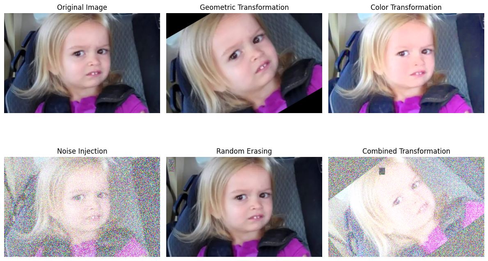

# Understanding Data Augmentation

Data augmentation is a technique used to improve the generalization of machine learning models by artificially increasing the size and diversity of the training dataset. This is achieved by applying various transformations to the existing data, creating new, slightly modified versions of the original samples.

## How It Works

### What is Data Augmentation?

- **Definition**: Data augmentation involves applying transformations such as rotation, flipping, cropping, scaling, and more to the training data.
- **Purpose**: It helps the model learn to generalize better by exposing it to a wider variety of data patterns, reducing overfitting.

### Common Data Augmentation Techniques

1. **Geometric Transformations**

   - **Examples**: Rotation, flipping, cropping, scaling, translation.
   - **Effect**: Helps the model become invariant to changes in orientation, size, and position of objects in the data.
   - _ELI5_: Imagine taking a picture and rotating it slightly or zooming in. The object remains the same, but the perspective changes.

2. **Color Transformations**

   - **Examples**: Brightness adjustment, contrast adjustment, color jittering.
   - **Effect**: Helps the model become robust to variations in lighting and color conditions.
   - _ELI5_: Think of taking a photo in different lighting conditions—sunny, cloudy, or indoors.

3. **Noise Injection**

   - **Examples**: Adding random noise to images or data.
   - **Effect**: Helps the model handle noisy or imperfect data.
   - _ELI5_: Imagine a slightly blurry or grainy photo. The object is still recognizable, but the details are less clear.

4. **Random Erasing**
   - **What it does**: Randomly erases parts of the image.
   - **Effect**: Forces the model to focus on the remaining parts of the image, improving robustness.
   - _ELI5_: Imagine covering parts of an image with sticky notes. The model learns to recognize the object even with missing parts.

---

### Combined Visualization of Data Augmentation Techniques

---

### Benefits of Data Augmentation

- **Increased Dataset Size**: Augmentation creates more training samples, effectively increasing the dataset size.
- **Improved Generalization**: By exposing the model to diverse variations, it learns to generalize better to unseen data.
- **Reduced Overfitting**: Augmentation reduces the risk of the model memorizing the training data.

---

### ELI5: Why Use Data Augmentation?

- Imagine teaching a child to recognize a cat. Instead of showing the same picture repeatedly, you show pictures of cats in different poses, colors, and lighting. The child learns to recognize cats in any situation. Data augmentation does the same for machine learning models.

---

**[← Previous](earlystop.md)** | **[END →](questions.md)**

## Navigation

- [Introduction to Regularization](README.md)
- [How Regularization Techniques Work](problem_solution.md)
- [Understanding L1 and L2 Regularization](LX.md)
- [Understanding Dropout Regularization](dropout.md)
- [Understanding Early Stopping](earlystop.md)
- [Understanding Data Augmentation](data_augmentation.md)
