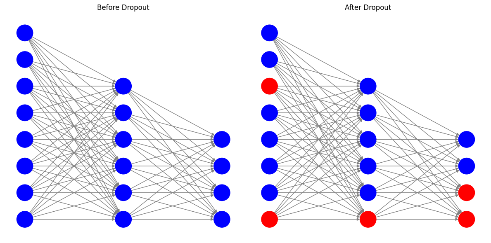
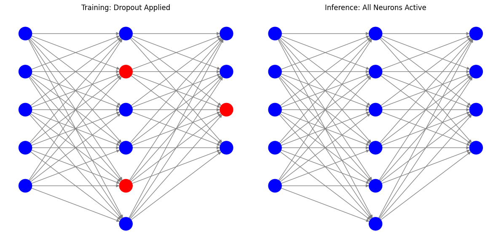

# Understanding Dropout Regularization

Dropout is a regularization technique used to prevent overfitting in neural networks by randomly "dropping out" (setting to zero) a fraction of the neurons during training. This forces the network to learn more robust features that generalize better to unseen data.

## How It Works

### Dropout Regularization

- **What it does**: During each training iteration, a random subset of neurons is ignored (dropped out) by setting their outputs to zero. This prevents the network from relying too heavily on specific neurons.
- **Mathematical Form**: For a given layer, each neuron is retained with a probability \( p \) (dropout rate is \( 1 - p \)). During training, the output of each neuron is scaled by \( \frac{1}{p} \) to maintain the expected output.
- **Effect**: Encourages the network to learn redundant representations, making it more robust to overfitting.

#### Visualizing Dropout Regularization

Below is an illustration of how dropout works in a neural network:

- **Before Dropout**: All neurons (blue circles) are active and connected.
- **After Dropout**: Some neurons (red circles) are "dropped out," meaning they are temporarily turned off during training. This forces the network to rely on multiple paths to make decisions, making it smarter and less likely to overfit.

Think of it like a sports team where some players are randomly benched during practice. The team learns to play better as a whole because everyone has to step up and contribute!

### Key Considerations

- **Dropout Rate**: The dropout rate \( 1 - p \) is a hyperparameter that determines the fraction of neurons to drop. Common values are between 0.2 and 0.5.
- **Training vs. Inference**: Dropout is only applied during training. During inference, all neurons are active, and their outputs are scaled appropriately.

Below is a visualization of the difference between training and inference:

---

#### ELI5: How the Model Works During Inference

Imagine you're practicing basketball, and during practice, some of your teammates are randomly told to sit out. This forces everyone else to work harder and learn to play better as a team. But during the actual game, everyone is back on the court, and the team plays even better because they’ve learned to rely on each other during practice.

Similarly, during training, the model learns to work without some neurons (dropout). When it's time for inference (making predictions), all neurons are active again, and their outputs are scaled to ensure the model behaves as expected. This way, the model uses everything it learned during training to make the best possible predictions.

---

### Advantages of Dropout

- Reduces overfitting by preventing co-adaptation of neurons.
- Encourages the network to learn more robust and generalized features.

---

### Disadvantages of Dropout

- Increases training time since the network needs to learn redundant representations.
- May require careful tuning of the dropout rate to achieve optimal performance.

---

**[← Previous](LX.md)** | **[Next →](earlystop.md)**

## Navigation

- [Introduction to Regularization](README.md)
- [How Regularization Techniques Work](problem_solution.md)
- [Understanding L1 and L2 Regularization](LX.md)
- [Understanding Dropout Regularization](dropout.md)
- [Understanding Early Stopping](earlystop.md)
- [Understanding Data Augmentation](data_augmentation.md)
