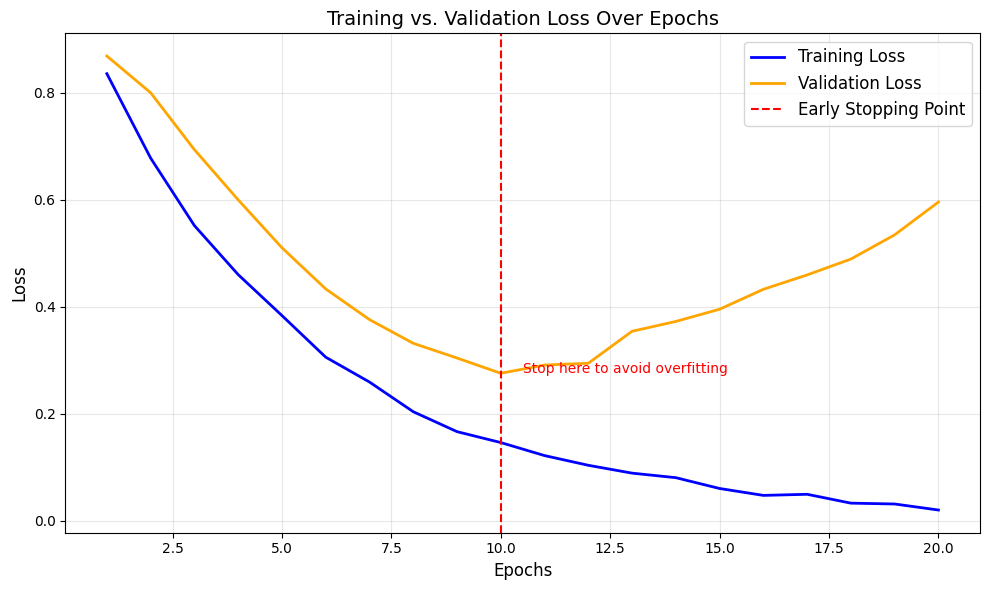

# Understanding Early Stopping

Early stopping is a regularization technique used to prevent overfitting in machine learning models by halting the training process when the model's performance on a validation set stops improving. It is a simple yet effective method to ensure the model generalizes well to unseen data.

## How It Works

### Early Stopping Regularization

- **What it does**: Monitors the model's performance on a validation set during training and stops training when the performance starts to degrade or plateaus.
- **Key Idea**: Overfitting occurs when the model starts to memorize the training data instead of learning general patterns. Early stopping prevents this by halting training before overfitting begins.
- **Implementation**: Typically, early stopping is implemented by tracking a metric such as validation loss or accuracy. If the metric does not improve for a specified number of epochs (patience), training is stopped.

#### Visualizing Early Stopping

**Training vs. Validation Loss Over Epochs**  
   
 _ELI5_: Imagine you're baking cookies. You check them every few minutes, and as soon as they look perfect, you take them out of the oven. If you leave them in too long, they'll burn (overfit). Early stopping is like taking the cookies out at just the right time.

### Key Considerations

- **Patience**: The number of epochs to wait for improvement before stopping. A larger patience value allows the model more time to improve but risks overfitting.
- **Metric to Monitor**: Common metrics include validation loss, validation accuracy, or other task-specific metrics.
- **Checkpointing**: Often, the best model (based on validation performance) is saved during training so it can be restored after early stopping.

---

#### ELI5: How Early Stopping Works

Imagine you're studying for an exam. You take practice tests to see how well you're doing. If your scores stop improving after a while, you stop studying because more practice won't help and might even confuse you. Early stopping works the same way—it stops training when the model stops improving on a validation set.

---

### Advantages of Early Stopping

- Prevents overfitting by halting training at the optimal point.
- Reduces training time by avoiding unnecessary epochs.
- Simple to implement and does not require additional hyperparameters.

---

### Disadvantages of Early Stopping

- Requires a validation set, which reduces the amount of data available for training.
- The choice of patience and monitored metric can significantly affect performance.
- May stop training prematurely if the validation metric fluctuates.

---

**[← Previous](dropout.md)** | **[Next →](data_augmentation.md)**

## Navigation

- [Introduction to Regularization](README.md)
- [How Regularization Techniques Work](problem_solution.md)
- [Understanding L1 and L2 Regularization](LX.md)
- [Understanding Dropout Regularization](dropout.md)
- [Understanding Early Stopping](earlystop.md)
- [Understanding Data Augmentation](data_augmentation.md)
